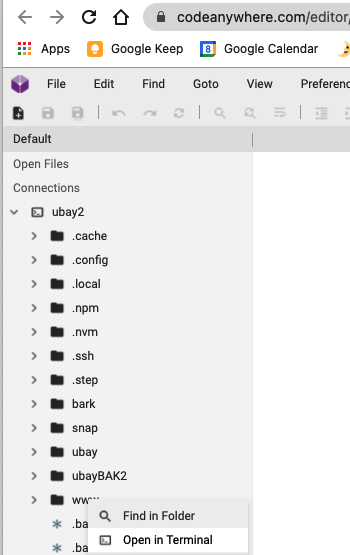
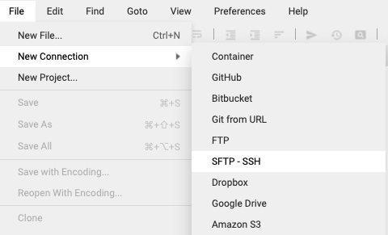

# An eXpress.js and Templating HElper (AXthe)
<i>AXthe tech stack is <b>A</b>n opinionated e<b>X</b>press.js and <b>T</b>emplating <b>HE</b>lper(AXthe) for high productivity web app development</i>.
 
#### Please star our repo
- http://github.com/axthe/axthe

#### Support and Forum
- http://github.com/axthe/axthe/discussions


# Setup
If you already have node.js setup, greater than version 14.17.1 (npm greater than 7.18.0), with Caddy http server running in the cloud and a Cloud based IDE, you are good to go, you can skip to guide.

- For latest: http://github.com/axthe/axthe and click Code/Download ZIP), or use wget from shell to download the file.
In MyAapp folder rename file envEx to ```.env```. Running ```r.sh``` should start your SSR app :-).


### Domain and server
- You need A DNS name/domain, I recommend Porkbun.com or http://easydns.com (and I recommend against GoDaddy), so get(or transfer) a domain that you can control.
- A $5-$10 / month ubuntu based OS server in the cloud. You can pick anything similar to http://primcast.com, http://vultr.com, http://hetzner.com, http://soyoustart.com, Digital Ocean, Linode, etc. Likely that anything Ubuntu in the cloud will do the job.


## Setup recipe
After you create an Ubuntu instance in the cloud:
You should edit in the cloud, sign up for a cloud based IDE, I recommend http://codeanywhere.com/editor. For SSR mostly use a Cloud IDE, and for JAMstack or mobile|cordova development you could use local VS Code.

- Step number one(Cloud IDE), using the Cloud IDE (CodeAnywhere) after you open the IDE, connect to the Ubuntu instance in the cloud via ssh. You should see the editor and be able to ssh. Like this:



And this is the screen to setup the connection, select ssh:




Optional: Additionally, you can add a VS Code plugin in to develop remotely, by following instructions here http://code.visualstudio.com/docs/remote/ssh, read 'Connect to a remote host' (F1 then 'SSH connect window to a remote host')

- Ubuntu config:

 run the setup script: http://github.com/AXthe/AXthe/blob/main/setup.sh, you can cut and paste, line by line. I cut and paste a few line in at a time (into the Cloud IDE). As a part of setup you should make sure you are running Python v3.X and not the older version.

(or you can try #wget -O - https://raw.githubusercontent.com/axthe/axthe/main/setup.sh | bash )


- Step number three(Caddy):

Then create Caddyfile similar to this:
http://github.com/axthe/axthe/blob/main/Caddyfile

and
```
caddy start
```
or caddy stop as needed. Everytime you change the Caddyfile you need to stop and start it.

Notice that there is a:
```
{
	respond "hi"
}
```

Configure a sub domain in your dns to go there! :-)

You may need to glance the Caddy docs on their web site, but: you must know how to connect a DNS to your server. That is this step, don't go to next step till you are comfortable connecting N number of apps installed on your linux server to DNS, so that you can go to it from your browser via HTTPS.


- Step number four(AXthe):

For latest: http://github.com/axthe/axthe and click Code/Download ZIP), or use wget from shell to download the file.
In MyAPIapp folder rename file envEx to ```.env```. Running ```r.sh``` should start your SSR app :-). Also you can run.sh in my JAMapp.

There are several folders, you should connect each to Caddy+DNS. Likely you want to rename myAPIapp and myJAMapp folders to your app names, so that you can write more than one app, or have more than one version. The is the end of the setup!

### Setup recipe part II

Optional part, to demo scss, Ably and live reloading.
1. Create account on Ably. In .env file create a field ```ABLYr=``` and your Ably key. 
2. In ./lib/wapp add wapp.enablePageReload() 
3. If you now edit any pug file, the browser will reload :-)
4. If you have a style.scss file, and you edit any scss file, it will build style.css :-). For example, I renamed Bootstrap.scss to style.scss and now I can edit variables.scss and it will live reload my browser during development. So create something using one of the CSS frameworks.

## How to update

From time to time we update our AXthe stack, enviroment and scripts. Here is how to upgrade to a newer version:
1. Setup a new Ubuntu instance as per above.
2. Edit Caddyfile so you have new subdomains, for example version2.mydomain.com, and get it to just do hello world type stuff.
3. Rename folders to match your app names. (I assume you did not leave it as myAPIapp and myJAMapp, so change it to what your folders are called)
4. Option A: if using git, you can just create a new branch with the new clean version without your code and then merge branches with the old version with your code.
Option B: if not using git, just copy and paste your files over the new AXthe stack.
5. Now you can move your DNS around as needed, for example you have your old box with older code and your new box with newer code. Maybe use legacy.mydomain.com to point to the old app, and alpha.mydomain.com to point to the new app.


### As needed shell commands that you can cut/paste:

```
ufw status

killall node

ps aux | grep node

nvm alias default 14.17.1
```
